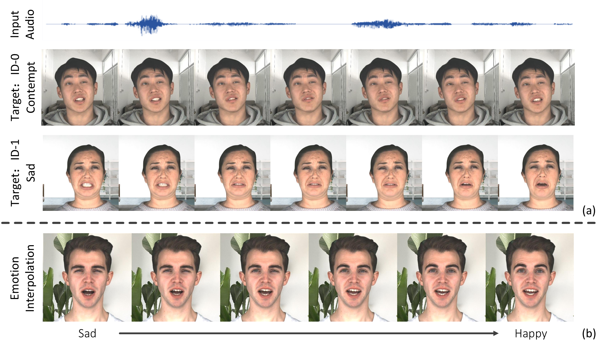

# Audio-Driven Emotional Video Portraits [CVPR2021]

Xinya Ji, [Hang Zhou](https://hangz-nju-cuhk.github.io/), Kaisiyuan Wang, [Wayne Wu](http://wywu.github.io/), [Chen Change Loy](http://personal.ie.cuhk.edu.hk/~ccloy/), [Xun Cao](https://cite.nju.edu.cn/People/Faculty/20190621/i5054.html), [Feng Xu](http://xufeng.site/)

[[Project]](https://jixinya.github.io/projects/evp/)    [[Paper]](https://arxiv.org/abs/2104.07452)    



Given an audio clip and a target video, our Emotional Video Portraits (EVP) approach is capable of generating emotion-controllable talking portraits and change the emotion of them smoothly by interpolating at the latent space.

## Installation

We train and test based on Python3.6 and Pytorch. To install the dependencies run:

```
pip install -r requirements.txt
```

## Testing

- Download the pre-trained models and data under the following link: [google-drive](https://drive.google.com/file/d/1QQeE8ahQC_ErPBzTc6Kx5pzOAWcRoNs4/view?usp=sharing) (we release results of two target person: M003 and M030), unzip the `test.zip` and put the file in corresponding places.

- Step1 : audio2landmark
  
  The emotion of  predicted landmark motions can be manipulated by the emotion features (recommanded):
  
  ```
  python audio2lm/test.py --config config/target_test.yaml --audio path/to/audio --condition feature --emo_feature path/to/feature
  ```
  
  or by the emotional audio of the target person:
  
  ```
  python audio2lm/test.py --config config/target_test.yaml --audio path/to/audio --condition feature --emo_audio path/to/emo_audio
  ```
  
  The results will be stored in `results/target.mov`

- Step2 : landmark2video
  
  A parametric 3D face model and the corresponding fitting algorithm should be used here to regress the geometry, expression and pose parameters of the predicted landmarks and the target video. Here we release some parameters of the testing results.
  
   `lm2video/data/target/3DMM/3DMM:`  images and landmark positions of the video
  
   `lm2video/data/target/3DMM/target_test:` parameters of target's video
  
   `lm2video/data/target/3DMM/target_test_pose:` pose parameters of video
  
   `lm2video/data/target/3DMM/test_results:` parameters of predicted landmarks
  
  Here we use [vid2vid](https://github.com/NVIDIA/vid2vid) to generate video from edgemaps:
  
  1. Generate the testing data by running:
     
     ```
     python lm2video/lm2map.py
     ```
     
     and copy the results in `lm2video/results/` to `vid2vid/datasets/face/`.
  
  2. Replace the `face_dataset.py` and `base_options.py` in vid2vid to `lm2video/face_dataset.py` and  `lm2video/base_options.py`, the 106 keypoint version.
  
  3. Copy `lm2video/data/target/latest_net_G0.pth` to `vid2vid/checkpoints/target/` , `lm2video/test_target.sh` to `vid2vid/scripts/face` and run:
     
     ```
     bash ./scripts/face/test_target.sh
     ```

## Training

- Coming soon.     

## Citation

```
@article{ji2021audio,
  title={Audio-Driven Emotional Video Portraits},
  author={Ji, Xinya and Zhou, Hang and Wang, Kaisiyuan and Wu, Wayne and Loy, Chen Change and Cao, Xun and Xu, Feng},
  journal={arXiv preprint arXiv:2104.07452},
  year={2021}
}
```
